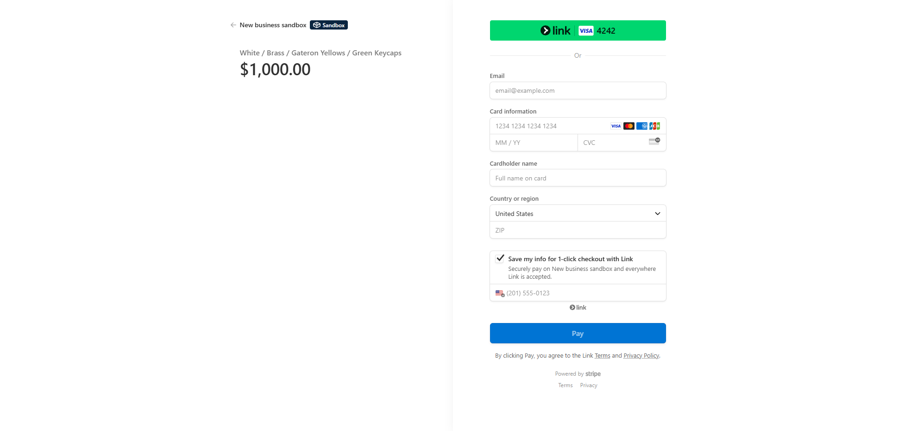

# ⌨️ Keyboard Configurator

A clean, responsive web app for customizing your mechanical keyboard’s case, plate, switches, and keycaps. The frontend is built with React and Vite (with Tailwind CSS), and is live on GitHub Pages. The backend, built with Node.js/Express and hosted on Render, securely integrates with Stripe to handle checkout sessions and payments.


---

## 🔗 Live Demo

[View on Vercel](https://configurator-pearl-eta.vercel.app/)

---

## 🚀 Features

- **Keyboard Part Customization**  
  Select your preferred case, plate, switches, and keycaps to build your ideal mechanical keyboard.
- **Live Visual Preview**  
  Instantly see your keyboard configuration update as you choose different parts and colors.
- **Responsive Design**  
  Enjoy a seamless experience on desktop, tablet, and mobile devices.
- **Add to Cart & Quantity Management**  
  Add your custom build to the cart, adjust quantities, and review your selections before checkout.
- **Secure Stripe Checkout**  
  Complete your purchase safely with integrated Stripe payment processing.

---

## 🛠️ Tech Stack

- **Frontend:**  
  - React 
  - Vite 
  - Tailwind CSS 
  - Heroicons (SVG icon library)  

- **Backend:**  
  - Node.js + Express  
  - Stripe (secure payment processing)  

- **Hosting:**  
  - Vercel (frontend)  
  - Render (backend)


## 📦 Installation

1. **Clone the repository**  
   ```bash
   git clone https://github.com/gavinnewin/configurator.git
   cd configurator


## 📷 Screenshots

### Homepage


### Demo Build


### Add to Cart


### Stripe Checkout

